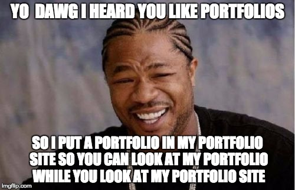

# Portfolio

## Overview

Create a static portfolio webpage highlighting your work so far. Focus first on having a good structure so you can add some great style to it with CSS!

## Due

This project is due **Monday, 10/17/2016, at 9:00 AM**.

Turn it in via the [homework submission link](https://docs.google.com/forms/d/e/1FAIpQLSccCpx8AiNaVqhBSWwLfawF2VthjZWQlHDH8eN2EDM3krTjww/viewform).

## Tasks

### Required Tasks

- [ ] Yak Shaving
  - [ ] Create a project/repository called `portfolio`
  - [ ] Create a static HTML site, including a file called `index.html` that will serve as the landing page for your portfolio
- [ ] Projects (3)
  - [ ] Name of project
  - [ ] Screenshot
  - [ ] Link to GitHub code
  - [ ] Unique skills used
  - [ ] Should be able to easily add additional projects later
- [ ] About Me
  - [ ] Brief biographical information
  - [ ] List of skills
  - [ ] Link to GitHub/LinkedIn
  - [ ] Photo/image
  - [ ] Contact information
- [ ] Look & Feel
  - [ ] Responsive layout
  - [ ] Doesn't look like a standard bootstrap template

### Stretch Tasks

- [ ] Incorporate fancy features such as:
  - [ ] Carousel of your screenshots
  - [ ] Parallax scrolling
  - [ ] [Material Design](https://material.google.com/#) effects
  - [ ] Pop in elements as they are scrolled to

## Details

Your task is to create a portfolio website that you will ultimately share with employers. You will likely want to revisit this later as your knowledge increases, but you should focus on getting a solid HTML structure in place so you aren't scrambling to put something together later on!

You should have several sections of your site. You can create the entire site as one page with several sections, or several pages.

For this version of your portfolio, you should have at least 3 projects. You can have more if you like, but don't just put a link to every single thing you've ever made - focus on the projects/assignments you're most proud of. You will add to the portfolio later, especially when you finish your final project.

Each project should present some information about the project, and you should use CSS classes to make the projects have a similar look.

You should include an _About Me_ section that includes some personal information about yourself.

Your site should be responsive - it should be easily viewable on mobile, tablet, and desktop screen sizes.

### Stretch Tasks

Incorporate some effects, using jQuery plugins, other libraries, or your own JavaScript.

You can include your portfolio site as one of the sites on your portfolio site!

## Hints

You may want to use Bootstrap to get things started, but probably don't want to set it up as a full MVC project. You can get a folder complete with Bootstrap, jQuery, and some starter boilerplate HTML from http://www.initializr.com/ - just be sure to choose the **Bootstrap** version.

Don't worry about getting things pixel-perfect right now. Get the structure in place so that you can make a great responsive site, and update the CSS as you get more comfortable coding.

Make sure that all the images you use are in your project folder and that you aren't just hotlinking them from the web somewhere.

You may also want to use a starter template. [HTML5 Up](https://html5up.net/) includes a bunch of templates that you are free to use as long as you include the proper attribution on the bottom of your page. Note that if you are particularly interested in jobs that emphasize front-end engineering, you may wish to create yours from scratch. It isn't cheating to use something like this, but it also doesn't really show off any of your _own_ front-end skills.
