# Deployment

Shortcuts for all the steps are down below in the [Overview](#Overview) section!

## AppHarbor

Azure is tightly integrated with Visual Studio which makes it ideal for "simple" deployment, but as of the time of this writing, it doesn't appear to offer long-term free database hosting. For portfolio/educational projects, you may wish to host your project somewhere totally for free.

Luckily, [AppHarbor](https://appharbor.com/) offers that service!

### Limitations

They say the best things in life are free, but there's also no such thing as a free lunch. AppHarbor's free tier has some limitations - it can only handle a certain amount of traffic, and free databases are limited to 20 MB. This means you probably can't use it to store images or binary data (uploads) in the database, but if you're just storing text and not a lot of it, you might be able to get by.

## Overview

1. Make sure your code is up-to-date in GitHub
1. Switch to a custom `RequireHttpsAttribute` if you are requiring SSL (check in `App_Start/FilterConfig.cs`, [example code here](https://gist.github.com/runesoerensen/915869))
1. Create an AppHarbor app and link it with your GitHub repo
1. Create a `yocto` (free) database on AppHarbor
1. Rename the database alias to match your `Web.config` connectionString
1. Deploy the app from the AppHarbor application page
1. (Optional) Seed data
   1. Create script(s) for the data you want to seed
   1. Connect to the database using the hostname, username, and password in [SQL Server Management Studio](https://msdn.microsoft.com/en-us/library/mt238290.aspx)
   1. Run the script(s) in SMSS

## Detailed Instructions

1. Make sure your code is up-to-date in GitHub

   AppHarbor automatically gets the code to be deployed from GitHub. By default, it uses the `master` branch, and will automatically build anything in `master`. Yet another reason to keep `master` clean!

1. Switch to a custom `RequireHttpsAttribute` if you are requiring SSL

   Open `App_Start/FilterConfig.cs`. If you're using  `RequireHttpsAttribute`, or you have `[RequireHttps]` applied to any method, you'll need to use a custom attribute rather than the supplied one.

   Here's an example of what that could look like:

   **Original Code**
   ```cs
   using System.Web;
   using System.Web.Mvc;

   namespace ToDo
   {
       public class FilterConfig
       {
           public static void RegisterGlobalFilters(GlobalFilterCollection filters)
           {
               filters.Add(new HandleErrorAttribute());
               filters.Add(new RequireHttpsAttribute());
           }
       }
   }

   ```

   **Updated Code**
   ```cs
   using System;
   using System.Web;
   using System.Web.Mvc;

   using RequireHttpsAttributeBase = System.Web.Mvc.RequireHttpsAttribute;

   namespace ToDo
   {

       [AttributeUsage(AttributeTargets.Class | AttributeTargets.Method, Inherited = true, AllowMultiple = false)]
       public class RequireHttpsAttribute : RequireHttpsAttributeBase
       {
           public override void OnAuthorization(AuthorizationContext filterContext)
           {
               if (filterContext == null)
               {
                   throw new ArgumentNullException("filterContext");
               }

               if (filterContext.HttpContext.Request.IsSecureConnection)
               {
                   return;
               }

               if (string.Equals(filterContext.HttpContext.Request.Headers["X-Forwarded-Proto"],
                   "https",
                   StringComparison.InvariantCultureIgnoreCase))
               {
                   return;
               }

               if (filterContext.HttpContext.Request.IsLocal)
               {
                   return;
               }

               HandleNonHttpsRequest(filterContext);
           }
       }


       public class FilterConfig
       {
           public static void RegisterGlobalFilters(GlobalFilterCollection filters)
           {
               filters.Add(new HandleErrorAttribute());
               filters.Add(new RequireHttpsAttribute());
           }
       }
   }
   ```

   The example code was taken from [here](https://gist.github.com/runesoerensen/915869)).

   Make sure you commit and push the code to GitHub.

1. Create an AppHarbor app and link it with your GitHub repo

   If you don't already have an [AppHarbor](https://appharbor.com/) account, create one (it's free, no credit card required).

   Visit the [Applications](https://appharbor.com/applications) page, and enter a name for your app. This will become part of the URL, as in `https://yourappname.apphb.com`.

   

   Click the **Configure GitHub to deploy to AppHarbor** link under the **Getting Started** heading.

   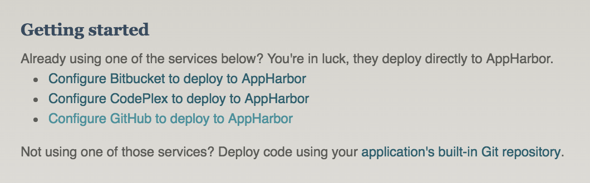

   Approve the permissions as requested.

   Select the repository of the project you wish to deploy from the dropdown list, and click **Add**. Note that projects that are part of an _organization_ will show up at the bottom of the list.

   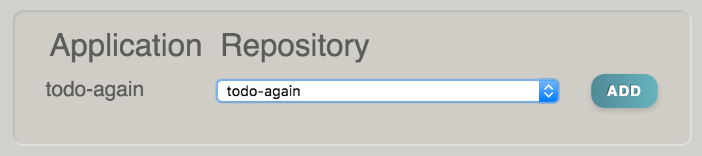

   **NOTE**: If you get a _Failure - Bad Request_ message, it may be because the app was previously deployed to AppHarbor. Visit the **Settings** page for the GitHub repository, and delete the AppHarbor webhook, then try again.

   AppHarbor will now grab your code from GitHub and try to build it. We aren't ready to deploy it just yet, but you should see something like this on your application page in AppHarbor:

   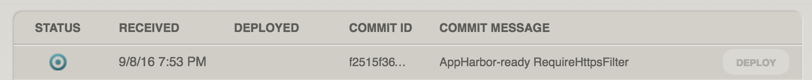

1. Create a `yocto` (free) database on AppHarbor

   Click the `Add-ons` link on the left side of your application page on AppHarbor.

   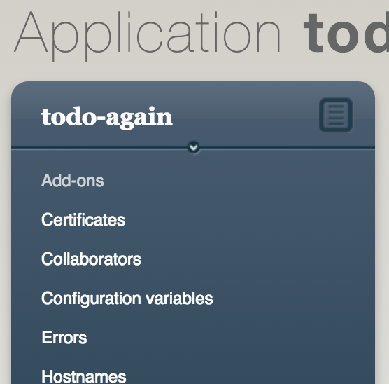

   Click on `SQL Server`.

   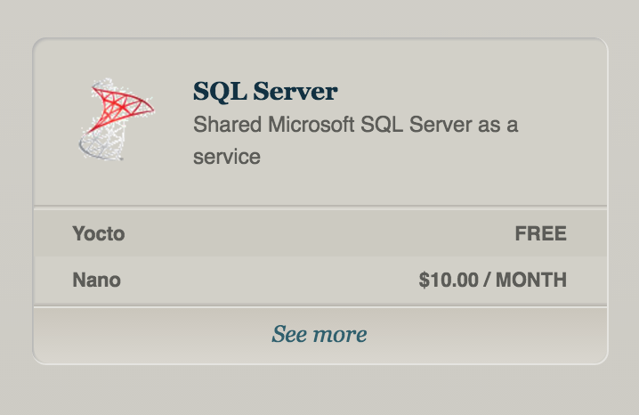

   Click `Install` next to the **Yocto plan** (the free one).

   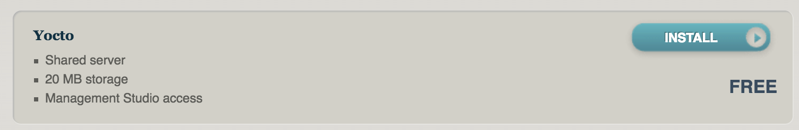

1. Rename the database alias to match your `Web.config` connectionString

   Open your `Web.config` file in Visual Studio. Look for the `<connectionStrings>` tag. Inside that, there should be one `<add>` tag. Copy the `name` attribute from that (in the image below, the name is `DefaultConnection`).

   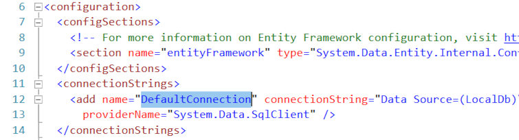

   Click on `SQL Server` under the **Installed add-ons** heading, then click `Go to SQL Server` on the following page.

   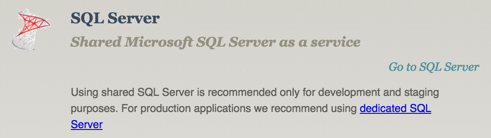

   Click the `Edit database configuration` button.

   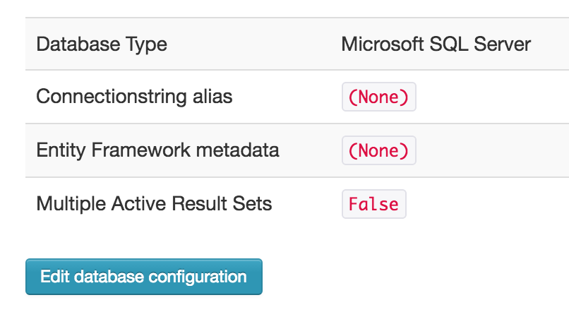

   Paste the name of the connection string in the `Alias` box and click **Update**.

   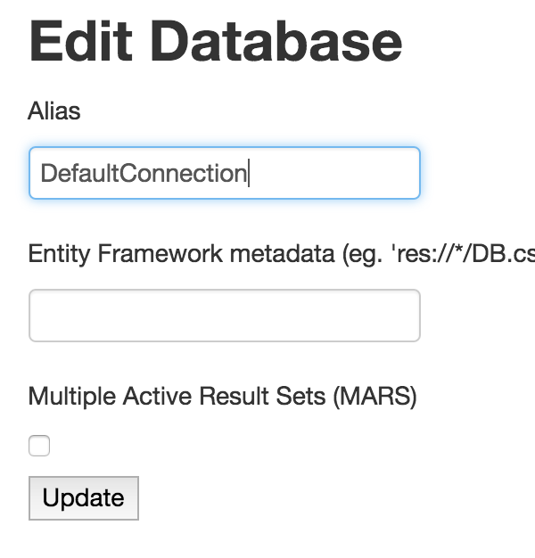

1. Deploy the app from the AppHarbor application page

   From the AppHarbor application page, click the `Deploy button`. After a minute or so, it should change the status to `Active`. Click on the `Go to your application` link at the top of the page to try it out!

   Make sure to visit a page that accesses the database. You may run into errors if your pages assume some data is in the database. You need to visit a page to have AppHarbor create the tables first. We'll fill them with seed data in the next step.

1. _(Optional)_ Seed data

   It is possible to seed data using AppHarbor, but it doesn't seem to run the `Seed` method by default. A more reliable way to ensure the data is seeded is to do it manually by connecting to the database server from SQL Server Management Studio (SSMS).

   First you will need to create script(s) for the table(s) you want to use to seed the database. Then you'll connect to the live database from SSMS, and run the scripts.

   1. Create script(s) for the data you want to seed

      After you have seeded your database, use SQL Server Object Explorer in Visual Studio to find your application's database and tables.

      Right-click on the table you want to save, and choose `View Data`.

      There are two buttons at the top of the window that look like ancient manuscripts (_scripts_). Click the one on the right to **Script to File**. Save it somewhere where you can find it - you'll be using it soon!

      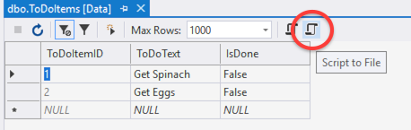

   1. Connect to the database using SQL Server Management Studio.

      On the SQL Server page in AppHarbor, you can see the `Hostname`, `Username`, and `Password` for your database. Open SQL Server Management Studio, and paste these values in, making sure to choose `SQL Server Authentication` as the Authentication method.

      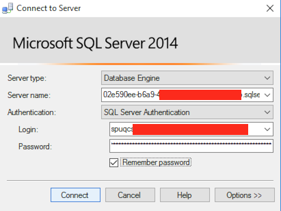

   1. Run the script(s) in SMSS

      Open the SQL file(s) you scripted above in SMSS, and click the `Execute` button for each of them.

      Right-click each of the tables and choose `Select Top 1000 rows` to verify that they contain the data you expect.
