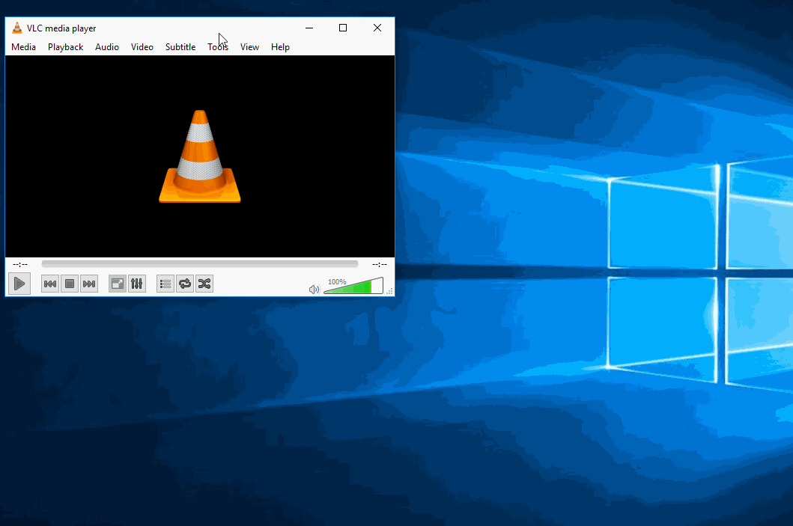

# Presentation Tools

You should make standalone videos of each portion of the app you want to present. Then, for your presentation you will set up a playlist of these videos, and cue each video in sequence so that you have something interesting happening on the screen while you talk.

## Video Capture

[FlashBack Express](http://www.flashbackrecorder.com/express) can be used to capture your screen. Record your screen _without_ any audio. You should choose the **region** option so that it only captures your site - don't include any toolbars/desktop backgrounds. You may also want to use Chrome in [incognito mode](https://support.google.com/chrome/answer/95464?source=gsearch&hl=en) so that nothing is automatically filled in on web forms.

After you've recorded a video, you need to **export** it. The default export settings won't quite give you exactly what you want, though. Save the resulting video from FlashBack Express, and then open it by double-clicking the `fbr` file.

We want to turn off cursor highlighting so there isn't a big yellow circle around the mouse pointer. At the top of the screen, open the `Effects` menu and choose `Highlight Cursor`.

On the `Cursor Highlight` tab, uncheck `Highlight mouse cursor,` then switch to the `Clicks` tab and uncheck `Highlight mouse clicks`. Click **OK** to save it.

Click the **Export** button, and save a `WMV` file. This is what you'll be using for your presentation.

## Playlist

Don't edit the videos together into one giant movie. Keep them as separate 10-20 second clips. We'll use [VLC media player](http://www.videolan.org/) to play them in a sequence with minimal distraction.

Download VLC from this link: http://www.videolan.org/

After installing VLC, open up the preferences menu from `Tools` > `Preferences`.

On the `Interface` tab, uncheck `Show controls in full screen mode`, and check `Pause on the last frame of a video`.

On the `Subtitles/OSD` tab, uncheck `Enable On Screen Display (OSD)` and `Show media title on video start`. Then click **Save**.

These options will make the presentation less distracting.

### Making a Playlist

Next, you need to create a playlist that strings all your video files together in the correct order. In VLC, click on the `View` menu and choose `Playlist`.

Drag your files into the playlist window. You can drag videos or images into the playlist. I recommend having a static image as the first item in your playlist - this will be a great placeholder while you get things set up/plugged in.

Once your playlist is built, you should save the playlist from the `Media` > `Save Playlist to File`.

### Running the Playlist

Now, when you click the play button, it will start your playlist. Click the play button, then double click the player window to make it full screen once you've plugged into the projector.

To switch between videos, you'll use the `n` and `p` keys on your keyboard. `n` will jump to the next video, and `p` will go back. `Space` can be used to play/pause playback (though if you split your clips right, you shouldn't need to do this!). It will not start the next video until you hit `p`.
